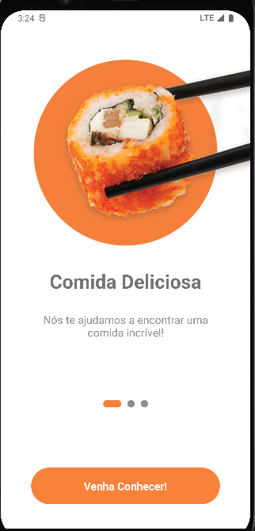
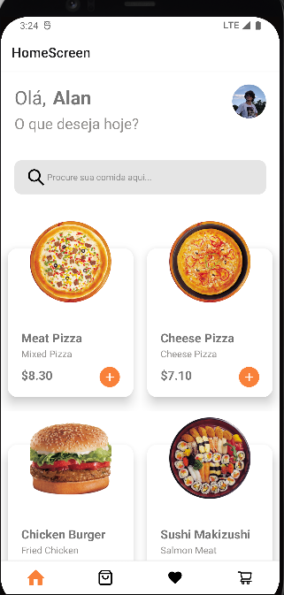
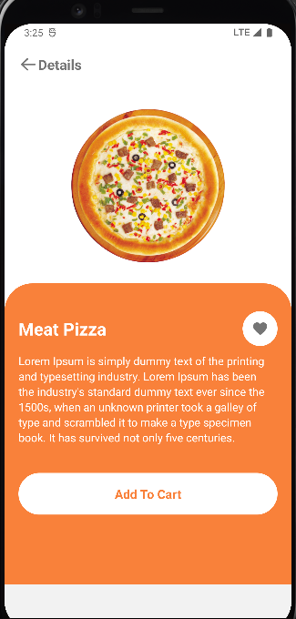
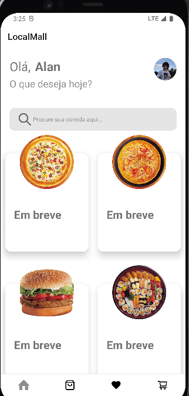
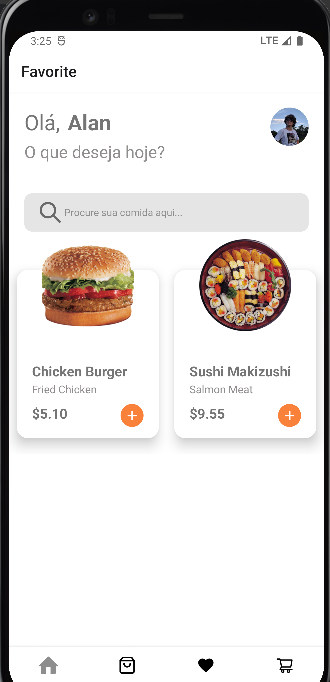
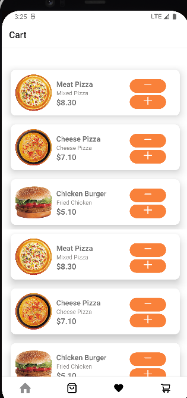

# Xfood App

* The "X-food" project is a mobile application developed in React Native, inspired by the popular "iFood" app.
* The objective is to create an e-commerce platform, providing users with the ability to browse and place orders at various restaurants and establishments.
* The app includes features such as a favorites list, order history, a shopping cart with the option to send orders to WhatsApp, a product screen, and details for each item, as well as a search bar to look for products.
* It's important to note that some features may not be fully implemented.

* The "X-food" aims to provide a convenient and personalized shopping experience, allowing users to explore a variety of culinary options and place orders effectively, whether for delivery or pickup.

## Table of contents

- [Overview](#overview)
  - [Built with](#built-with)
  - [Screenshot](#Screenshot)
- [Author](#author)

## Overview
* E-commerce Platform: The app provides a functional e-commerce platform that allows users to explore restaurant options and place orders.

* Key Features Implemented: Key features such as favorites list, order history, shopping cart, and product details were successfully implemented.

* Integration with WhatsApp: The app enables users to send orders directly to WhatsApp, making the purchasing process more convenient.

* Intuitive User Interface: The app's interface was designed with usability in mind, ensuring users can easily navigate restaurants and products.

* Product Search: The search bar provides users with the ability to search for specific products, making it easier to find desired items.

* Potential for Future Developments: While some features may not be fully implemented, the project establishes a solid foundation for future developments and enhancements.

### Built with

- HTML5
- REACT NATIVE
- CSS3
- JS and JSX
- Async Storage

## Author

- Github - [#MyProfile](https://github.com/AlanDavid-007/X-food/)

### Screenshot

